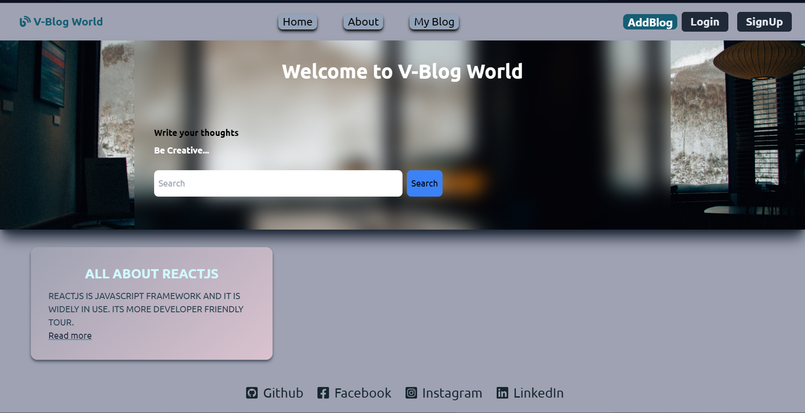

# v-blog #

## [What I learned?]##
[NPm]
-[Reactjs](https://react.dev/)
 [commands]-
 [npm create vite@latest projectname]
 [ cd projectname]
  [npm install]
 [npm run dev]
 
-[Tailwind Css](https://tailwindcss.com/)
  [commands]-
  1. Go to the website
  2. click get started
  3.[Framework guides]
  4.[vite]
  5. copy and paste the commands in CLI
  
-[Nodejs]
