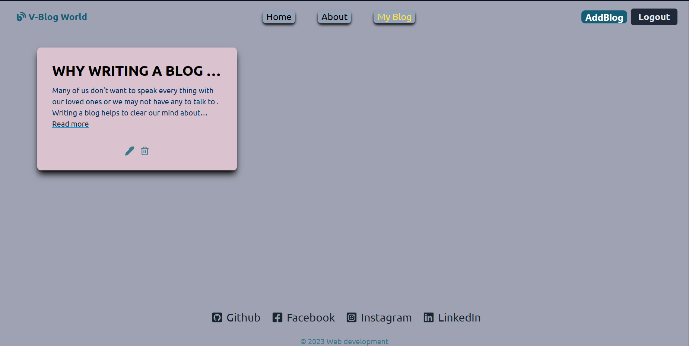
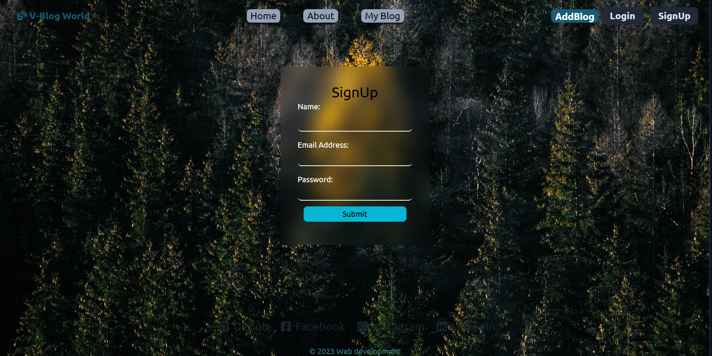
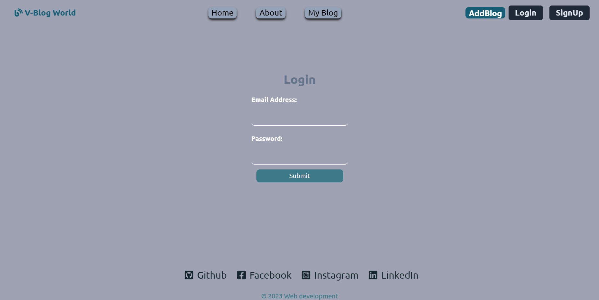
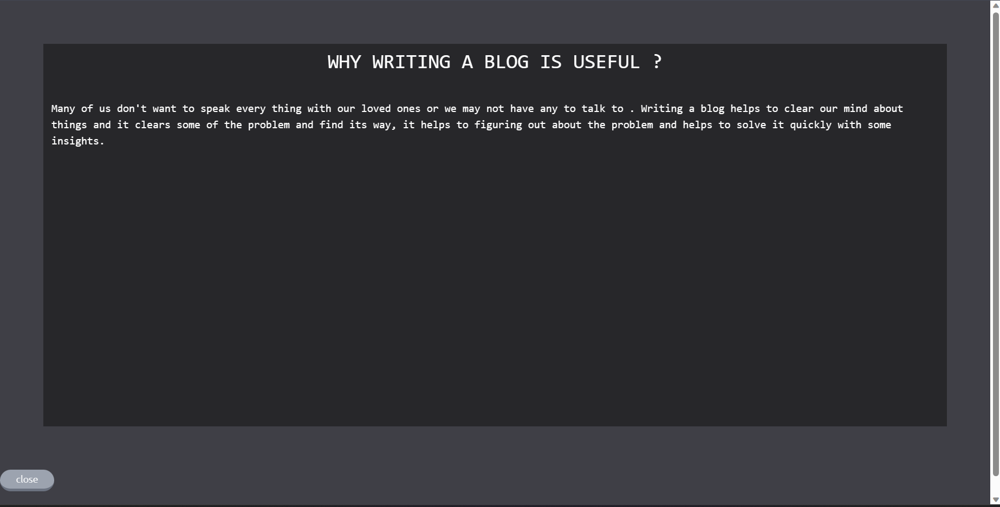

# v-blog #

This is a blogging website where any user can add their blog after logging in  to the site . Any blog written in their account will be displayed in homescreen. A user will have the access to edit and delete their own blog.

## The main page ##

## MyBlog page ##

## SignUp page ##

## Log in ##

## Read more section in card ##

## [What I learned?]##
[NPm]
-[Reactjs](https://react.dev/)
 [commands]-
 [npm create vite@latest projectname]
 [ cd projectname]
  [npm install]
 [npm run dev]
 
-[Tailwind Css](https://tailwindcss.com/)
  [commands]-
  1. Go to the website
  2. click get started
  3.[Framework guides]
  4.[vite]
  5. copy and paste the commands in CLI
  
-[Nodejs]
